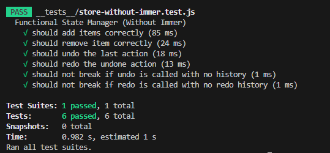

# 📦 Functional Programming State Manager

A **modular and extensible state management system** built on functional programming principles, offering **immutable state updates**, **undo/redo capabilities**, and seamless **React integration**. This project showcases multiple implementations, including one powered by **Immer** for optimized updates.

## 📂 Overview

This repository explores functional programming principles applied to state management through three distinct implementations:

- ✨ **fp-with-immer** — Leverages `Immer` for concise and efficient immutable state updates and patch-based history tracking.

- 🔧 **fp-without-immer** — Implements immutable state management manually, showcasing foundational functional programming techniques.

- ⚛️ **fp-react-state** — A React application demonstrating practical integration of the functional state manager without Immer, featuring an interactive UI with undo/redo.

## 📁 Project Structure

```bash
fp-state-manager/
├── fp-react-state       # React frontend consuming the FP state manager (without Immer)
├── fp-with-immer        # Functional state manager implementation utilizing Immer
└── fp-without-immer     # Functional state manager implementation without Immer
```

## 📝 Implementation Details

### ✨ fp-with-immer

- Uses Immer's produce and patch features to ensure immutable state updates with minimal boilerplate.

- Implements undo/redo via Immer’s patch-based history, optimizing performance and memory usage.

- Incorporates a pure reducer for predictable state transformations.

- Includes a logging utility for action traceability.

### 🔧 fp-without-immer

- Provides a pure reducer that manages immutable state updates using native JavaScript techniques (spread operators, array filtering).

- Manages history explicitly with past, present, and future state arrays to enable undo/redo.

- Demonstrates core functional programming patterns without external dependencies.

- Supports action logging for debugging.

### ⚛️ fp-react-state

- React-based UI that interacts with the functional state manager without Immer.

- Interactive UI supporting:

  - ✅ Add/Remove items
  - ↩️ Undo/Redo
  - 📊 History tracking (counts of past and future actions)

## 📷 Screenshots

### 📝 React UI


### 🔄 FP with Immer Console Output


### ⚙️ FP without Immer Console Output


### ⚙️ FP Immer Test Result


### ⚙️ FP without Immer Test Result



## 🚀 Getting Started

### ⚙️ Prerequisites

- Node.js ≥ 14.x
- m or Yarn

### 🛠 Installation & Usage

Each implementation is standalone with its own dependencies. Follow these steps to explore each:

#### 📦 Clone the repository

```bash
git clone https://github.com/melos-simeneh/fp-state-manager.git
cd fp-state-manager
```

#### ⚛️ Run the React Frontend (without Immer)

```bash
cd fp-react-state
npm install
npm run dev
```

- Starts the app at [http://localhost:5173](http://localhost:5173)

#### ✨ Run Immer-Based State Manager

```bash
cd fp-with-immer
npm install
npm start # or node index
```

- Runs console-based examples using Immer's patch system

- Demonstrates performant, immutable state handling with undo/redo

#### 🔧 Run Vanilla Functional State Manager (No Dependencies)

```bash
cd fp-without-immer
npm install
npm start # or node index
```

- Runs example scripts showing reducer-based state transitions

- Undo/redo logic built from scratch using pure JavaScript

## 🧪 Running Tests

Each implementation includes Jest tests to verify dispatch, undo, and redo functionality.

Run tests for Immer implementation:

```bash
cd fp-with-immer
npm install
npm test
```

Run tests for Vanilla implementation:

```bash
cd fp-without-immer
npm install
npm test
```

## 👨‍💻 Author

Built with 💚 by **Melos**
